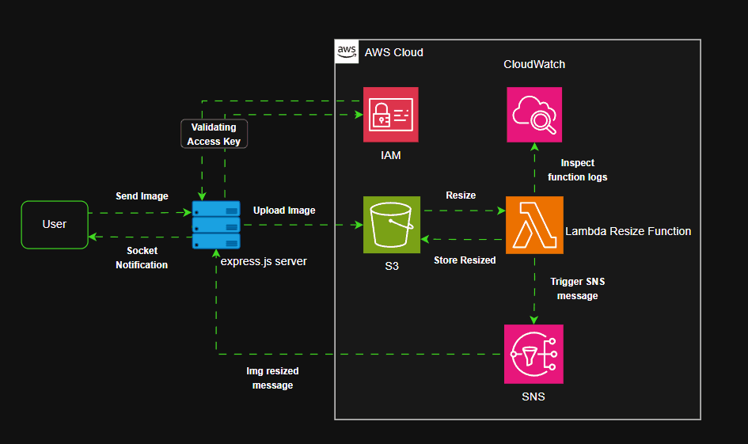

# ResI: Serverless Image Resizing Pipeline  
*Automatically resize images uploaded to S3 using AWS Lambda, with real-time client notifications via Socket.IO.*

---

---

## 🔧 How It Works  
1. **Upload**: Images are uploaded to an S3 bucket.  
2. **Trigger**: S3 event triggers a Lambda function to resize the image.  
3. **Notify**: Resized image metadata is sent to the client via:  
   - **SNS** (for server-side subscription confirmation)  
   - **Socket.IO** (real-time frontend updates)  
4. **Render**: Client displays the resized image.  

---

## ⚠️ Critical Requirements  

### AWS Credentials  
- The website **requires AWS IAM access keys** (access key ID + secret key) with permissions for:  
  - S3 (read/write)  
  - Lambda (invoke)  
  - SNS (publish/subscribe)  
- *Never expose keys client-side* — use server-side environment variables.  

### S3 Bucket Permissions  
- Objects **must be publicly accessible** (`public-read` ACL or bucket policy) to render on the website.  
- **Caution**: Avoid exposing sensitive data; use signed URLs for production.  

### SNS Confirmation  
- The server **must confirm SNS subscription** (HTTP/S endpoint) to receive Lambda completion alerts.  

### Socket.IO  
- Ensure the client maintains a persistent connection to receive "resize complete" events.  

---

## 📝 Environment Setup  

### AWS Services  
1. Configure Lambda with S3 trigger permissions  
2. Set up SNS topic linked to Lambda and your server endpoint  

### Server  
- Add all required credentials and configurations to your `.env` file  
- Configure `socket.io` to listen for SNS-triggered events:  

## 🔒 Security Notes
  
### AWS Keys
Rotate keys regularly and restrict IAM policies to least-privilege access

### S3 Public Access
Use only for demo/non-sensitive data

### For production:

Replace with signed URLs (e.g., via CloudFront)

Restrict Lambda to specific S3 prefixes
